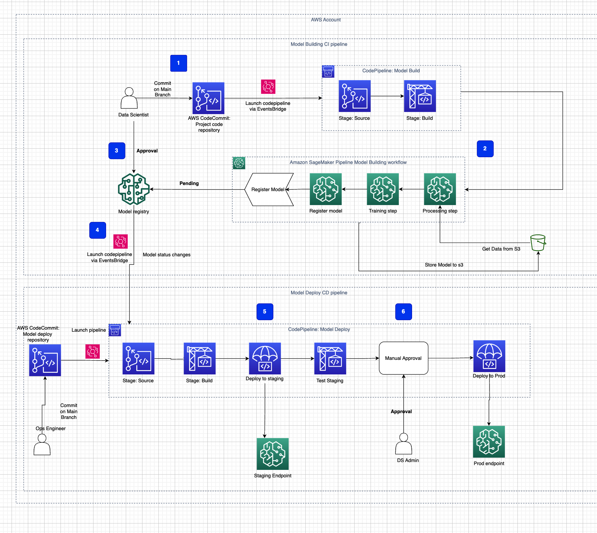

# aws-mlops-cdk
> ### Cdk toolkit for model building ci pipeline

This projects deploy the aws resources to build a ci pipeline for model training and model deployment based on the below architecture.
using AWS clouformation toolkit.

## MLOPS architecture

## AWS Resources Overview
### 1. AWS CodeCommit Repository
    Resource: source_repo
    Description: Acts as the source code repository for the model training pipeline.
    Usage: Stores the source code which, upon updates, triggers the CI/CD pipeline.
### 2. AWS S3 Bucket
    Resource: artifacts_bucket
    Description: Used to store artifacts generated during the build and deployment processes.
    Usage: Ensures the retention of build and deployment history, critical for rollback and auditing.
### 3. AWS EventBridge Rule
    Resource: code_commit_rule
    Description: Defines a rule that triggers on changes to the main branch of the CodeCommit repository.
    Usage: Automates the pipeline execution upon code changes, facilitating continuous integration.
### 4. AWS CodeBuild Project
    Resource: code_build_project
    Description: Responsible for building the model training workflow from the repository.
    Usage: Executes the build process, including the creation and execution of SageMaker pipelines.
### 5. AWS CodePipeline
    Resource: model_build_pipeline
    Description: Defines the stages and actions of the CI/CD pipeline.
    Usage: Orchestrates the workflow from source code retrieval to building and storing the model.
### 6. IAM Role for AWS CodePipeline
    Resource: pipeline_role
    Description: An IAM role with permissions for AWS CodePipeline to access necessary AWS resources.
    Usage: Grants CodePipeline access to S3 for storing and retrieving pipeline artifacts.
### 7. Event Rule Target for AWS CodePipeline
    Resource: code_commit_rule
    Description: Links the EventBridge rule to trigger the CodePipeline.
    Usage: Enables automatic pipeline execution in response to source code changes.
### 8. CloudFormation Outputs
    Resource: CfnOutput
    Description: Provides easy access to key resource identifiers like bucket name and pipeline name.
    Usage: Useful for quickly retrieving the names of crucial resources post-deployment.